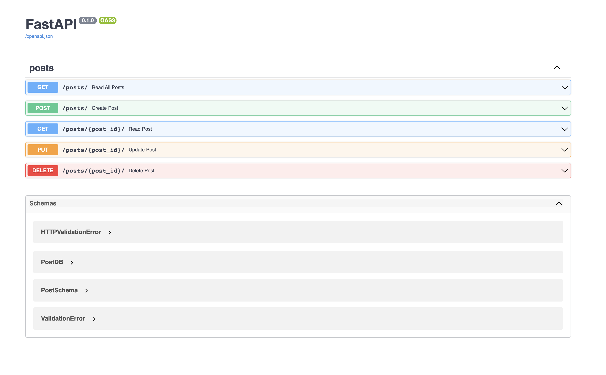

# FastAPI Project

[](https://github.com/hamzaijaz-dev/fastapi-project/blob/main/.github/workflows/codeql.yml)

This repository contains a very structured and clean code for asynchronous example api using the [FastAPI](https://fastapi.tiangolo.com/), [Uvicorn](https://www.uvicorn.org/) Server and [Sqlite](https://www.sqlite.org/index.html) Database to perform crud operations on blog posts. This will help you to learn about FastAPI Framework.




## How to setup this project:

1. Clone this Repo

   `git clone https://github.com/hamzaijaz-dev/fastapi-project`
2. Cd into the fastapi-project folder

   `cd fastapi-project`
3. Create a virtual environment

   `python -m venv venv`
4. Activate virtualenv

   `source venv/bin/activate`

5. Install the required packages

   `python -m pip install -r requirements.txt`
6. Start the app

   ```shell
   python main.py
   ```

   Or Start the app using Uvicorn:

   ```shell
   uvicorn app.main:app --reload --workers 1 --host 0.0.0.0 --port 8002
   ```

7. I have used sqlite in this project. But, you can use any database as per required. 

8. Check the app on [posts](http://localhost:8000/posts)
Open your browser and navigate to [docs](http://localhost:8000/docs) to view the swagger documentation for the api.

## Documentation

Open API Documentation is provided by [Redoc](http://localhost:8000/redoc)

## Contributing

Contributions are welcome, please open an issue or submit a PR.

## License

[MIT](https://choosealicense.com/licenses/mit/)
